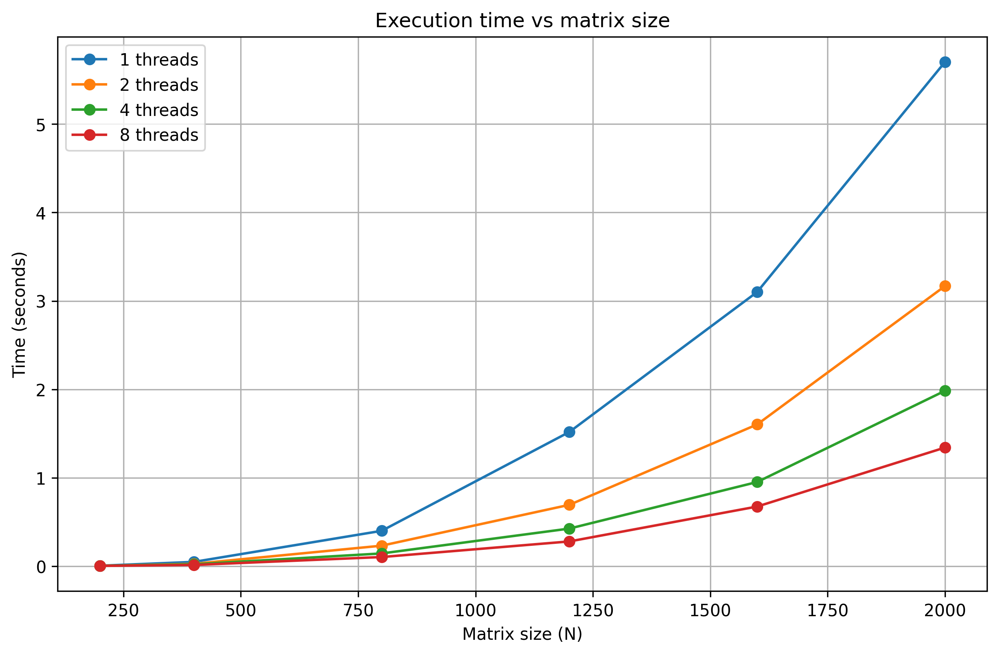
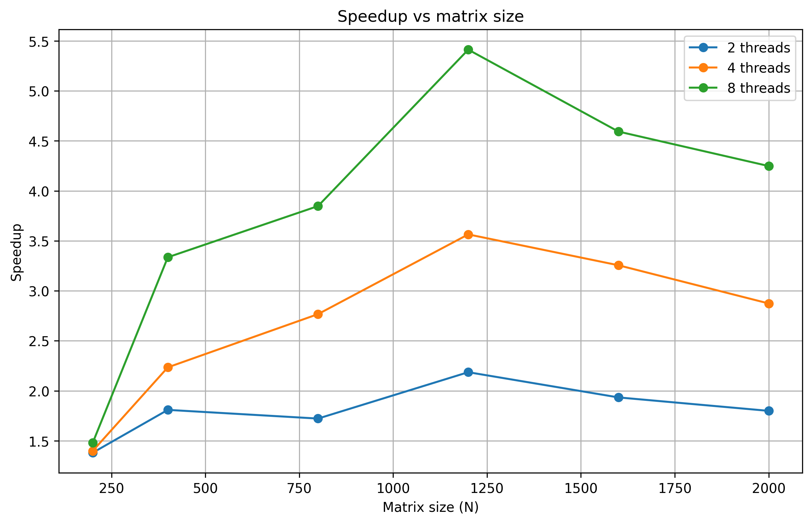
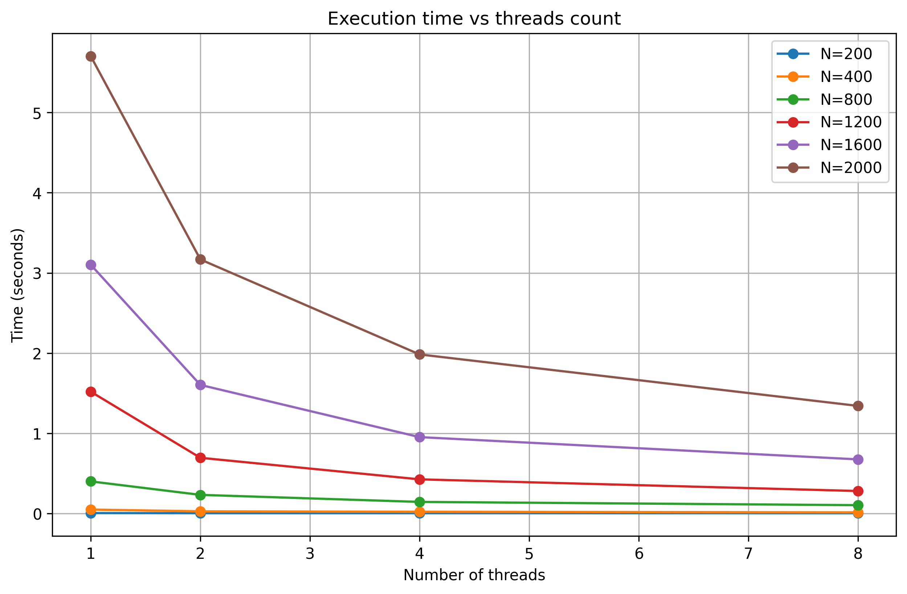

# Лабораторная работа №2: Параллельное умножение матриц (OpenMP)

## Цель работы

Модифицировать программу умножения матриц для параллельного выполнения с использованием OpenMP. Исследовать эффективность параллелизации в зависимости от размера матриц и количества потоков.

## Описание модификации

В программу добавлена директива `#pragma omp parallel for` перед внешним циклом по строкам. Каждый поток обрабатывает свою группу строк, что позволяет выполнять умножение параллельно без синхронизации.

## Условия экспериментов

- **Размеры матриц:** 200, 400, 800, 1200, 1600, 2000
- **Количество потоков:** 1, 2, 4, 8
- **Аппаратура:** 16 логических ядер, 16 GB RAM
- **Компилятор:** Visual Studio 2022, Release mode, /openmp

## Результаты

### Таблица 1. Время выполнения (секунды)

| N    | 1 поток | 2 потока | 4 потока | 8 потоков |
| ---- | ------- | -------- | -------- | --------- |
| 200  | 0.0059  | 0.0043   | 0.0042   | 0.0040    |
| 400  | 0.0492  | 0.0272   | 0.0220   | 0.0148    |
| 800  | 0.4005  | 0.2325   | 0.1447   | 0.1041    |
| 1200 | 1.5190  | 0.6947   | 0.4261   | 0.2806    |
| 1600 | 3.1016  | 1.6036   | 0.9526   | 0.6752    |
| 2000 | 5.7018  | 3.1681   | 1.9839   | 1.3421    |

### Таблица 2. Ускорение (T₁ / Tₚ)

| N    | 2 потока | 4 потока | 8 потоков |
| ---- | -------- | -------- | --------- |
| 200  | 1.38     | 1.40     | 1.48      |
| 400  | 1.81     | 2.24     | 3.34      |
| 800  | 1.72     | 2.77     | 3.85      |
| 1200 | 2.19     | 3.57     | 5.41      |
| 1600 | 1.93     | 3.26     | 4.59      |
| 2000 | 1.80     | 2.87     | 4.25      |

### Таблица 3. Эффективность (Speedup / p)

| N    | 2 потока | 4 потока | 8 потоков |
| ---- | -------- | -------- | --------- |
| 200  | 0.69     | 0.35     | 0.19      |
| 400  | 0.91     | 0.56     | 0.42      |
| 800  | 0.86     | 0.69     | 0.48      |
| 1200 | 1.10     | 0.89     | 0.68      |
| 1600 | 0.97     | 0.82     | 0.57      |
| 2000 | 0.90     | 0.72     | 0.53      |

## Графики

### График 1. Время выполнения от размера матрицы

### График 2. Ускорение от размера матрицы

### График 3. Время от количества потоков

## Анализ результатов

### 1. Время выполнения

С увеличением размера матрицы время выполнения растет. Увеличение числа потоков уменьшает время для всех размеров. Наибольший эффект виден на матрицах размером 800 и больше.

### 2. Ускорение

Чем больше потоков, тем быстрее работает программа. На 2 потоках ускорение в среднем в 1.8-2.2 раза, на 4 потоках — в 2.2-3.6 раза, на 8 потоках — в 3.3-5.4 раза. Максимальное ускорение (5.41) получено на 8 потоках при размере 1200.

### 3. Маленькие матрицы

Для матрицы 200x200 ускорение небольшое, так как накладные расходы на создание потоков сопоставимы со временем вычислений.

## Выводы

1. OpenMP позволяет ускорить умножение матриц за счет параллельной обработки строк.

2. Наибольший выигрыш дает использование 4-8 потоков для матриц размером 800 и более.

3. Для маленьких матриц параллельная версия не дает существенного преимущества.

4. Полученные результаты подтверждают эффективность использования OpenMP для ресурсоемких вычислений.
