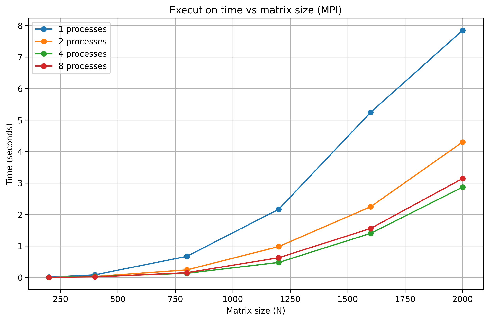
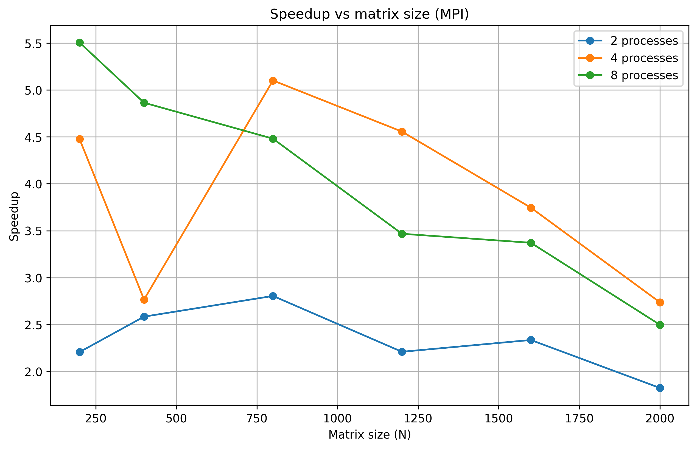
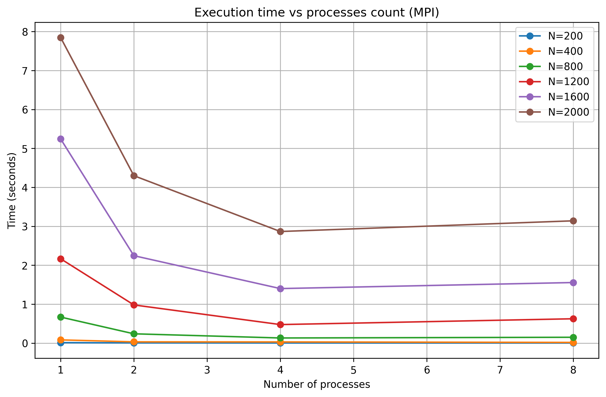

# Лабораторная работа №3: Параллельное умножение матриц (MPI)

## Цель работы

Модифицировать программу умножения матриц для параллельного выполнения с использованием MPI. Исследовать эффективность параллелизации в зависимости от размера матриц и количества процессов.

## Описание модификации

Программа распределяет строки матрицы A между процессами с помощью `MPI_Scatterv`. Матрица B рассылается всем процессам через `MPI_Bcast`. Каждый процесс вычисляет свою часть результирующей матрицы C, после чего результаты собираются через `MPI_Gatherv`.

## Результаты

### Таблица 1. Время выполнения (секунды)

| N    | 1 процесс | 2 процесса | 4 процесса | 8 процессов |
| ---- | --------- | ---------- | ---------- | ----------- |
| 200  | 0.0115    | 0.0052     | 0.0026     | 0.0021      |
| 400  | 0.0818    | 0.0316     | 0.0296     | 0.0168      |
| 800  | 0.6678    | 0.2381     | 0.1309     | 0.1491      |
| 1200 | 2.1650    | 0.9796     | 0.4752     | 0.6244      |
| 1600 | 5.2424    | 2.2445     | 1.3997     | 1.5550      |
| 2000 | 7.8455    | 4.2988     | 2.8653     | 3.1400      |

### Таблица 2. Ускорение (T₁ / Tₚ)

| N    | 2 процесса | 4 процесса | 8 процессов |
| ---- | ---------- | ---------- | ----------- |
| 200  | 2.21       | 4.42       | 5.48        |
| 400  | 2.59       | 2.76       | 4.87        |
| 800  | 2.80       | 5.10       | 4.48        |
| 1200 | 2.21       | 4.55       | 3.47        |
| 1600 | 2.34       | 3.74       | 3.37        |
| 2000 | 1.82       | 2.74       | 2.50        |

### Таблица 3. Эффективность (Speedup / p)

| N    | 2 процесса | 4 процесса | 8 процессов |
| ---- | ---------- | ---------- | ----------- |
| 200  | 1.11       | 1.11       | 0.69        |
| 400  | 1.30       | 0.69       | 0.61        |
| 800  | 1.40       | 1.28       | 0.56        |
| 1200 | 1.11       | 1.14       | 0.43        |
| 1600 | 1.17       | 0.94       | 0.42        |
| 2000 | 0.91       | 0.69       | 0.31        |

## Графики

### График 1. Время выполнения от размера матрицы

### График 2. Ускорение от размера матрицы

### График 3. Время от количества процессов

## Анализ результатов

### 1. Время выполнения

С увеличением размера матрицы время выполнения растет. При использовании 2-4 процессов наблюдается заметное ускорение. Для матрицы 200x200 время снизилось с 0.0115 до 0.0021 секунды (почти в 5 раз).

### 2. Ускорение

Максимальное ускорение достигнуто на матрице 800x800 с 4 процессами (5.10x). На 8 процессах ускорение ниже из-за накладных расходов на коммуникацию.

### 3. Аномалии

Для N=800 и N=1200 на 8 процессах время выше, чем на 4 процессах. Это связано с тем, что накладные расходы на передачу данных между 8 процессами превышают выигрыш от параллелизации.

### 4. Маленькие матрицы

Для N=200 ускорение хорошее (5.48x на 8 процессах), так как матрица целиком помещается в кэш.

## Выводы

1. MPI позволяет эффективно распределить вычисления между процессами

2. Оптимальное количество процессов для данной задачи — 4

3. Дальнейшее увеличение числа процессов не дает прироста производительности из-за коммуникационных накладных расходов
