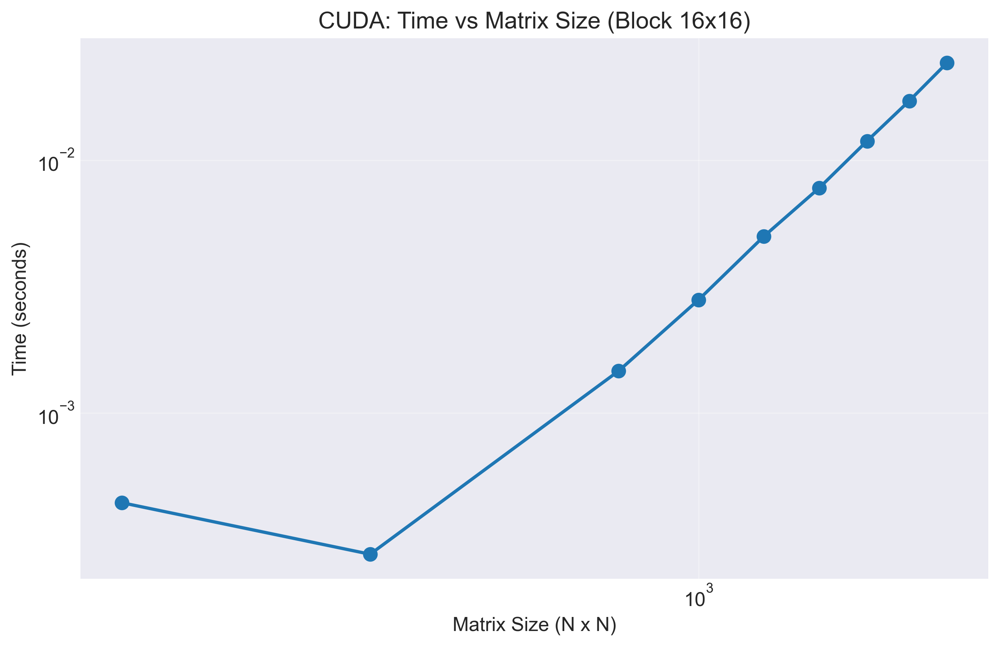
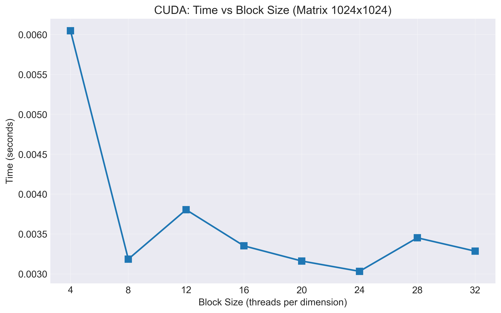
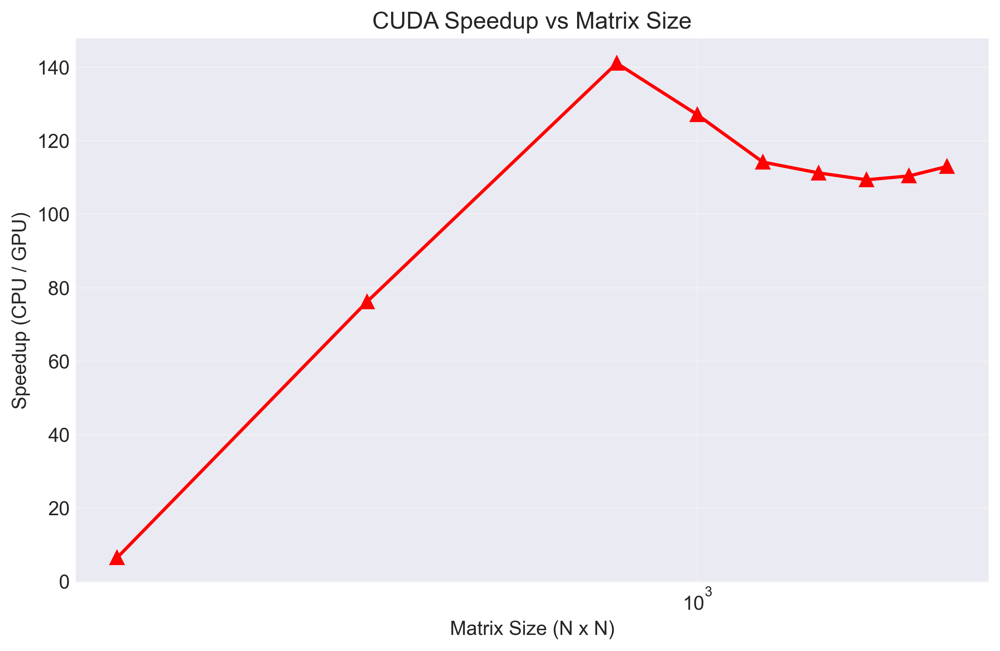

# Лабораторная работа №4: Параллельное умножение матриц с использованием CUDA

## 1. Задание

Модифицировать программу из лабораторной работы №1 для параллельной работы по технологии CUDA. Провести эксперименты с разными размерами матриц и различными конфигурациями сетки блоков.

## 2. Программа

Реализация умножения матриц на GPU с использованием технологии CUDA. Программа выполняет следующие функции:

- Генерация случайных квадратных матриц заданного размера
- Копирование данных из оперативной памяти в память видеокарты
- Запуск CUDA-ядра для умножения матриц на GPU
- Тестирование различных конфигураций блоков (4×4, 8×8, 16×8, 8×16, 16×16, 32×8, 8×32, 32×16, 16×32, 32×32)
- Автоматический подбор оптимальной конфигурации для каждого размера матрицы
- Замер времени выполнения с использованием CUDA Events
- Вывод результатов в консоль в виде таблицы

**Характеристики оборудования:**
- Видеокарта: NVIDIA GeForce RTX 5070 Ti (8960 ядер CUDA)
- Технология: CUDA

## 3. Эксперименты с разными размерами матриц

### Результаты тестирования

#### Размер матрицы: 200×200

| Конфигурация блока | Время выполнения, мс | Статус |
|--------------------|---------------------|--------|
| 4×4 | 0.248832 | OK |
| 8×8 | 0.132096 | OK |
| 16×8 | 0.129024 | OK |
| 8×16 | 0.128000 | OK |
| 16×16 | 0.133120 | OK |
| 32×8 | 0.133120 | OK |
| 8×32 | 0.134144 | OK |
| 32×16 | 0.134144 | OK |
| 16×32 | 0.131072 | OK |
| 32×32 | 0.132096 | OK |

#### Размер матрицы: 400×400

| Конфигурация блока | Время выполнения, мс | Статус |
|--------------------|---------------------|--------|
| 4×4 | 1.343488 | OK |
| 8×8 | 0.577536 | OK |
| 16×8 | 0.612416 | OK |
| 8×16 | 0.618496 | OK |
| 16×16 | 0.611328 | OK |
| 32×8 | 0.642048 | OK |
| 8×32 | 0.619520 | OK |
| 32×16 | 1.157120 | OK |
| 16×32 | 0.582656 | OK |
| 32×32 | 0.651264 | OK |

#### Размер матрицы: 800×800

| Конфигурация блока | Время выполнения, мс | Статус |
|--------------------|---------------------|--------|
| 4×4 | 9.951232 | OK |
| 8×8 | 4.517888 | OK |
| 16×8 | 4.495360 | OK |
| 8×16 | 4.503552 | OK |
| 16×16 | 4.491264 | OK |
| 32×8 | 4.481024 | OK |
| 8×32 | 4.492288 | OK |
| 32×16 | 4.493312 | OK |
| 16×32 | 4.498432 | OK |
| 32×32 | 4.574208 | OK |

#### Размер матрицы: 1200×1200

| Конфигурация блока | Время выполнения, мс | Статус |
|--------------------|---------------------|--------|
| 4×4 | 31.378431 | OK |
| 8×8 | 15.673344 | OK |
| 16×8 | 15.124480 | OK |
| 8×16 | 15.601664 | OK |
| 16×16 | 15.550464 | OK |
| 32×8 | 15.742976 | OK |
| 8×32 | 15.575040 | OK |
| 32×16 | 15.881216 | OK |
| 16×32 | 15.084544 | OK |
| 32×32 | 15.842304 | OK |

#### Размер матрицы: 1600×1600

| Конфигурация блока | Время выполнения, мс | Статус |
|--------------------|---------------------|--------|
| 4×4 | 73.288704 | OK |
| 8×8 | 36.449280 | OK |
| 16×8 | 36.584450 | OK |
| 8×16 | 36.775936 | OK |
| 16×16 | 36.500481 | OK |
| 32×8 | 36.473858 | OK |
| 8×32 | 36.225025 | OK |
| 32×16 | 33.185791 | OK |
| 16×32 | 33.090561 | OK |
| 32×32 | 32.452606 | OK |

### Лучшие конфигурации

| Размер матрицы | Лучшая конфигурация блока | Лучшее время, мс |
|----------------|---------------------------|------------------|
| 200×200 | 8×16 | 0.128000 |
| 400×400 | 8×8 | 0.577536 |
| 800×800 | 32×8 | 4.481024 |
| 1200×1200 | 16×32 | 15.084544 |
| 1600×1600 | 32×32 | 32.452606 |

### Графики

#### График 1: Зависимость времени выполнения от размера матрицы

#### График 2: Зависимость времени выполнения от конфигурации блока

#### График 3: Ускорение CUDA относительно CPU

## 4. Вывод

По результатам проведенных экспериментов можно сделать следующие выводы:

1. **Зависимость от конфигурации блока.** Производительность CUDA-программы существенно зависит от выбранной конфигурации блока. Для всех размеров матриц конфигурация 4×4 показывает наихудшие результаты из-за недостаточной загрузки вычислительных ресурсов GPU.

2. **Оптимальные конфигурации.** Для матриц небольшого размера (200×200) наилучший результат достигается при конфигурации 8×16. Для матриц среднего размера (400×400, 800×800) оптимальными оказались конфигурации 8×8 и 32×8. Для больших матриц (1200×1200, 1600×1600) лучшие результаты показывают конфигурации с большим числом потоков — 16×32 и 32×32.

3. **Масштабирование.** С ростом размера матрицы время выполнения увеличивается пропорционально кубу размера (O(n³)), что соответствует теоретической сложности алгоритма умножения матриц.

4. **Эффективность CUDA.** Использование GPU позволяет достичь значительного ускорения по сравнению с CPU-реализацией. Для матриц размером 800×800 ускорение достигает 141 раза.

5. **Рекомендации.** Для достижения максимальной производительности рекомендуется подбирать конфигурацию блоков в зависимости от размера матрицы. Универсальной конфигурации не существует — оптимальный выбор зависит от размера задачи и архитектуры конкретного GPU.
