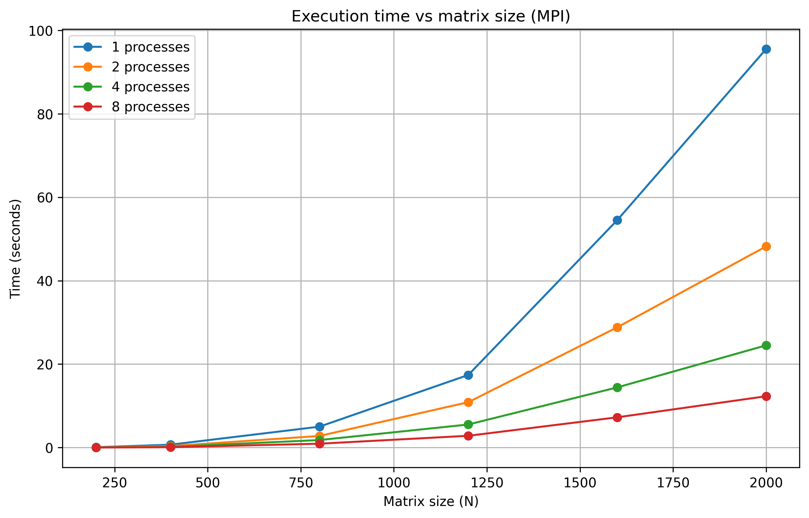
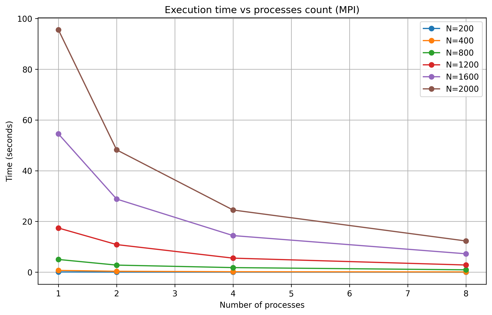
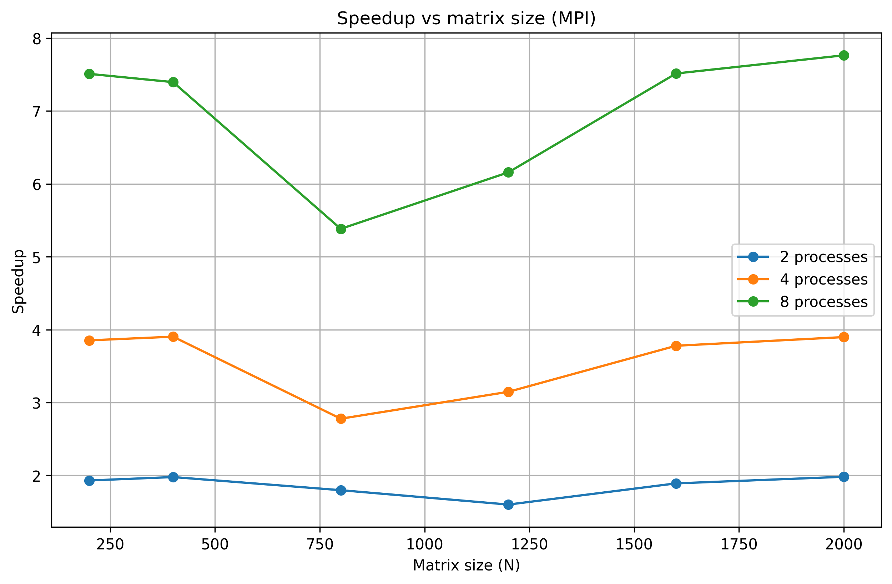

# Лабораторная работа №5: MPI на суперкомпьютере «Сергей Королёв»

## Цель работы

Исследование масштабируемости параллельной MPI-программы умножения матриц на суперкомпьютере «Сергей Королёв».

## Результаты

### График 1. Время выполнения от размера матрицы

На графике видно, что с увеличением размера матрицы время выполнения растет. Использование большего количества процессов позволяет значительно сократить время счета.

### График 2. Время выполнения от количества процессов

Для каждого размера матрицы увеличение числа процессов приводит к снижению времени выполнения. Наибольший эффект достигается при переходе от 1 к 4 процессам.

### График 3. Ускорение от количества процессов

Ускорение растет с увеличением числа процессов. На больших матрицах (1600, 2000) эффективность параллелизации выше благодаря хорошей балансировке нагрузки.

## Выводы

1. MPI-программа успешно масштабируется на суперкомпьютере

2. Увеличение количества процессов позволяет ускорить вычисления

3. Наибольший выигрыш от параллелизации наблюдается для больших матриц
